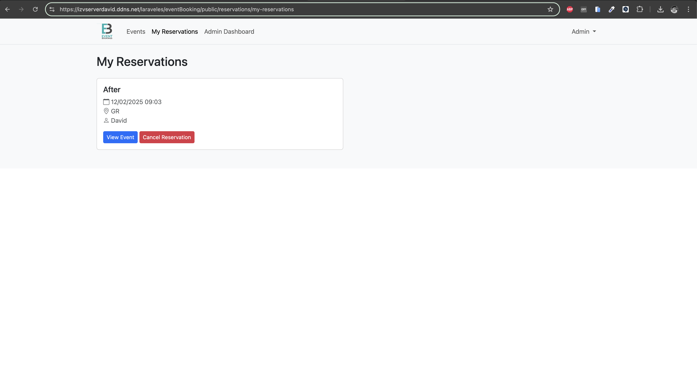

# Events Booking System

A Laravel event booking system that allows users to browse events, make reservations, and manage their bookings. Includes admin features for event management and user administration.

## Features

### User Features
- Browse available events 
- Search events by name and description
- Make event reservations
- View and manage personal reservations
- Email verification system
- Profile management

### Admin Features
- Event management (CRUD operations)
- View all reservations
- User management 
- Dashboard with statistics
- System monitoring

### Event Management
- Event creation with image upload
- Seat availability tracking
- Date and location management
- Automatic email notifications

## Requirements

- PHP >= 8.2
- Composer
- MySQL
- Node.js & NPM (for asset compilation)

## Installation

1. Clone the repository:
```bash
git clone git@github.com:davidrivasrodriguez/eventBooking.git
cd eventBooking
```

2. Install PHP dependencies:
```bash
composer install
```

3. Install frontend dependencies:
```bash
npm install
```

4. Copy the environment file and configure it:
```bash
cp .env.example .env
```

5. Generate application key:
```bash
php artisan key:generate
```

6. Create storage link:
```bash
php artisan storage:link
```

## Admin Access

Default admin credentials:
- Email: admin@example.com
- Password: password

## Routes

### Public Routes
- `/` - Home page with event listings
- `/events` - Browse all events
- `/events/{id}` - View event details
- `/login` - User login
- `/register` - New user registration

### Authenticated User Routes
- `/profile` - User profile management
- `/my-reservations` - View personal reservations

### Admin Routes
- `/admin/dashboard` - Admin dashboard
- `/events/create` - Create event
- `/events/{id}/edit` - Edit event

## Screenshots

### Login Page


### ForgotPassword Page


### Register Page


### Profile Page


### Events Page


### Create Event Page


### Event Details Page


### Event Edit Page


### My Reservations Page


### Dashboard Page


### Admin Dashboard Page
